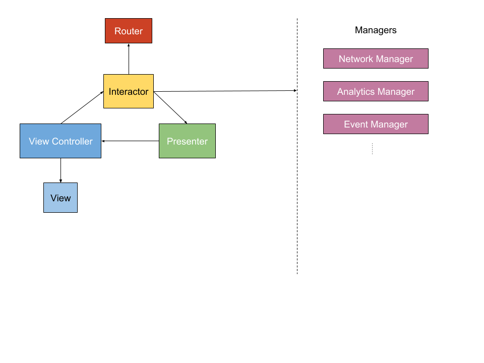

# SNPArchitecture

Here lies the architectural foundation for the years to come, for the generations to come. Take a moment and pay respect to our fallen brothers and sisters, whom had been beaten, broken and scarred, but paved the way on which we tread today.

## Quick Start

There have been many efforts to implement [Uncle Bob](https://en.wikipedia.org/wiki/Robert_Cecil_Martin)'s [Clean Architecture](https://8thlight.com/blog/uncle-bob/2012/08/13/the-clean-architecture.html) such as [VIPER](https://www.objc.io/issues/13-architecture/viper/) and Uber's [RIBs](https://github.com/uber/RIBs) but none of them were suitable for Snapp's current situation. Therefore, we decided to come up with our own, not giving it a particular name merely calling it `SNPArchitecture`.

To put it in simple terms, it is a combination of VIPER and RIBs, so if you're familiar with VIPER, you should be able to grasp it comfortably. Reading [Clean Swift](http://clean-swift.com/clean-swift-ios-architecture) is a good first step, because most of the notions are the same.
The key difference is SNPArchitecture's use of `VIP Cycle`.



## Components

An app is divided to modules based on screen/feature, which we'll call a `Scene`. A scene is comprised of these classes: View, Interactor, Presenter, Router and Configurator.

View handles view logic, Interactor handles business logic, Presenter handles presentation logic, Router handles routing logic and Configurator will act as the interface of the Scene. We'll discuss all of them shortly.

Keep in mind that all the interaction between classes in a scene happens through protocols and none of them are tightly coupled. 

### View

Unlike Apple's MVC, View in SNPArchitecture is both View and View Controller. Since View and View Controller are tightly coupled in iOS and UIKit, it doesn't make much sense to separate them. Because View Controller handles View's lifecycle, it is nearly impossible to write decoupled View and View Controllers, i.e. if you change one of them, you must change the other one.

View handles all the view logic, it knows how to show stuff on the screen and relays user's interactions to interactor. In order to better separate View and View Controller responsibilities, everything purely view-related stuff (such as setting static labels titles or setting colors) goes in UIView subclasses and lifecycle-related stuff (pretty much everything else) goes into UIViewController subclasses.

As you can see in the VIP Cycle, view directly notifies the Interactor of user interactions. Methods would be like `userTapped(on button:)`.

On the other hand, Presenter calls methods like `show(viewModel:)` on the View. Notice how Presenter passes a `View Model` to the view, which is a simple data structure comprised of primitive types such as `Int`, `String` and such. This is important, because view cannot and must not perform any logic on the received View Model. 

### Interactor

Interactor contains all the business logic of a scene. It knows how to fetch data, which scene must be displayed next and everything related to our business.

Interactor doesn't talk to the View directly, instead it asks the Presenter to present some stuff on the View with methods like `present(businessModel:)`. Notice how it passes a `Business Model` to Presenter, and Presenter itself translates this possibly complex data structure to a simple View Model. Remember, View Models are comprised of only primitive types that can be directly consumed by the view. 

On the other hand, it listens on user interactions coming from the View, such as `userTapped(on button:)`.

When a transition is needed to a new Scene, it calls a method on the Router. It will be discussed more in the Router section. 

### Presenter

Presenter is the class responsible for translating complex business models to simple view models. A good example of this would be converting a `Date` object to a human-readable `String`.

We've already talked about input and output interfaces of Presenter in View and Interactor sections, but here's a recap: Presenter listens on method calls from Interactor such as `present(businessModel:)`. It converts the incoming business model to a View Model understandable by the View, then calls `show(viewModel:)` on the View to complete the cycle.

### Configurator

Configurator acts as the interface for creating a scene. It has a static `build()` method which initializes a scene, provides each class its dependencies and returning the View, which is a subclass of UIViewController.

### Router

Router is responsible for routing logic, it knows how to build a Scene. It creates the next Scene and attaches its View to the View hierarchy. Interactor calls methods such as `routeToSomeScene(presentingViewController:)` on the Router, Router builds the next using its Configurator by calling `SomeSceneConfigurator.build()` and attaching the resulting View to the View hierarchy. Remember that the Router itself doesn't decide which Scene to build, but merely how to build it. Routing decisions are made by the Interactor. 

### Behind the Scenes: Managers

Although managers aren't usually behind the scenes and always want the spotlight, but in SNPArchitecture there are some classes that don't belong in Scenes: Model Managers. Will call them Managers for short. 

Each Manager is responsible for addressing issues related to that class. Fetching it from network, probably caching the result and providing it to anyone who asks for it later. Manager's methods will take the form of `model(parameters:completion:)`. They input required input and call a completion handler when data is ready or an error has occurred. Most of completion handlers will have only a `Error?` input, since providing data models will be mainly from a dispatch system.

### Dispatch System

Since we are developing SNPArchitecture for an eventful and stateful app, traditional delegation and callback patterns won't accomodate our needs. Consider the state of the `Ride` model. Every change in ride's state results in changes all over the application, so it's better to use the notification pattern. Since iOS's own NotificationCenter is a barebone framework, we'll use [SwiftNotificationCenter](https://cocoapods.org/pods/SwiftNotificationCenter) which provices a simple API to post and observe notifications in a protocol-friendly manner. 

## Sample Scene: About Snapp

In order for you to better understand SNPArchitecture, let's develop the "About Snapp" scene in the Passenger app together. 

Here are the screenshots of the about scene:


In this scene, we just want to fetch _About_ text from the network service and navigate to the _Snapp's Terms and Conditions_ web page if the user tap on the Terms button. We will explain each component of the `SNPArchitecture` and its counterpart.

### 1. View
The AboutView is as dummy as possible and knows nothing about other components of the app. Let's dive in.

All outlets from the storyboard go here:

```swift
class AboutView: UIView {
    @IBOutlet var divider: [UIView]!
    @IBOutlet var logo: UIImageView!
    @IBOutlet var indicator: UIActivityIndicatorView!
    @IBOutlet var terms: UIButton!
    @IBOutlet var version: UUILabel!
    @IBOutlet var about: UILabel!
}
```

Define colors data structure to use in dark mode:

```swift    
extension AboutView {
    private struct Colors {
        static let divider = MixedColor(normal: SNPColor.Gray.gray241, night: SNPColor.Gray.gray241)
        static let version = MixedColor(normal: SNPColor.gray, night: SNPColor.gray)
        static let terms = MixedColor(normal: SNPColor.Text.Accent.Dark.level1, night: SNPColor.Text.Accent.Dark.level1)
    }
 }
```

In the `awakeFromNib()` we set font and colors of our `UIView` objects. We also set an indicator to show and _about_ label to hide:

```swift
extension AboutView {   
    override func awakeFromNib() {
        super.awakeFromNib()
        logo.image = Constants.logo
        divider.forEach { div in
            div.mixedBackgroundColor = Colors.divider
        }
        about.font = SNPFont.font(size: 13, weight: .light)

        terms.setMixedTitleColor(Colors.terms, forState: .normal)
        
        version.mixedTextColor = Colors.version
        version.font = SNPFont.font(size: 13, weight: .light)
        version.numberOfLines = 2
        version.textAlignment = .center
        
        terms.setTitle(Constants.terms, for: .normal)
        terms.titleLabel?.font = SNPFont.font(size: 15 )
        
        about.text = ""
        about.numberOfLines = 0
        about.isHidden = true
        
        indicator.isIndicatorHidden = false
        
        if LanguageManager.shared.currentLanguage.direction == .rtl {
            about.textAlignment = .right
        } else {
            about.textAlignment = .left
        }
    }
}
```
To be orgnized we gather raw strings in one place. We'll stick to this approach wherever we can:

```swift
private struct Constants {
    static let logo = UIImage(named: "aboutUsLogo")
    static var terms: String {
        return NSLocalizedString("Snapp's Terms and Conditions", comment: "Snapp's Terms and Conditions")
    }
}
```
### 2. View Controller

All the `ViewController`s inherit from `SNPViewController`. In the `SNPViewController` we use some method to gather user static information and outsource lifecycle handling responsibility to the `SNPInteractorProtocol`.

Cast `SNPViewController`'s general purpose `SNPInteractorProtocol` to `AboutInteractorProtocol` and return it:

```swift
class AboutViewController: SNPViewController {

    var aboutInteractor: AboutInteractorProtocol! {
        get {
            return interactor as? AboutInteractorProtocol
        }
        set {
            interactor = newValue
        }
    }
    private var aboutView: AboutView {
        return view as! AboutView
    }
}
```
Setup initial works in `viewDidLoad()` :

```swift
extension AboutViewController {
    override func viewDidLoad() {
        super.viewDidLoad()
        title = Constants.title
        aboutView.terms.addTarget(self, action: #selector(termsTapped), for: .touchUpInside)
        setupNavigationBar()
    }
    
    fileprivate func setupNavigationBar() {
        navigationItem.leftBarButtonItem = splitViewController?.displayModeButtonItem
        navigationItem.leftItemsSupplementBackButton = true
    }
}
```swift
Here `AboutViewController ` tells `AboutInteractor` user has tapped _terms_ button:

```  
extension AboutViewController {      
    @objc func termsTapped() {
            aboutInteractor.termsTapped()
    }
}
```

Here `AboutViewController` shows given data from Presenter:

```swift
extension AboutViewController: AboutViewControllerProtocol {
    func set(version: String, build: String) {
        aboutView.version.text = String(format: "\(Constants.release)\n\(Constants.build)", version, build)
    }
    
    func setAbout(text: String) {
        aboutView.about.text = text
        aboutView.about.isHidden = false
        aboutView.indicator.isIndicatorHidden = true
    }
}
```

Told you! We always put constants in one place: :]

```swift
private struct Constants {
    static var title: String {
        return NSLocalizedString("About", comment: "About")
    }
    
    static var release: String {
        return "Version: %@"
    }
    static var build: String {
        return "Build: %@"
    }
}
```


### 3. Interactor

Store a reference to `AboutPresenter` and `AboutRouter`:

```swift
class AboutInteractor: SNPInteractor {
    var presenter: AboutPresenterProtocol!
    var router: AboutRouterProtocol!
}
```
`AboutInteractor` decides to navigate to the terms page when user tapped on button. It tells `AboutRouter` to do that:

```swift
extension AboutInteractor: AboutInteractorProtocol {
    @objc func termsTapped() {
        router.navigateToTerms()
    }
}
```
As we said before handling `AboutViewController`'s lifecycle is `AboutInteractor`'s job. `AboutInteractor` fetchs data from Model Managers and pass it to the `AboutPresenter`.

```swift
extension AboutInteractor {
    func viewDidLoad() {
        let releaseVersionNumber = InfoDictionaryManager.shared.shortVersionString
        let buildVersionNumber = InfoDictionaryManager.shared.version
        presenter.set(version: releaseVersionNumber ?? "", build: buildVersionNumber ?? "")
        AboutFetcher().fetchAbout(completion: { [weak self] about in
            self?.presenter.setAbout(text: about)
        })
    }    
}
```
Here `AboutInteractor` defines a worker to fetch appropriate data for itself from the `SNPNetwork`:

```swift
private class AboutFetcher {
    private struct URLs {
        static let about = ServerManager.shared.baseAPIPrefix + "about"
    }
    func fetchAbout(completion: @escaping (String) -> Void) {
        SNPNetwork.shared.request(url: URLs.about, encoding: JSONEncoding.default, responseKey: "data.text") { (about: String?, _: SNPError?) in
            completion(about ?? "")
        }
    }
}
```
### 4. Presenter

Store a reference to the `AboutViewController`. As you have noticed we use __weak__ here to avoid strong reference triple cycle:

```swift
class AboutPresenter: SNPPresenter {
    weak var viewController: AboutViewControllerProtocol!
}
```
`AboutPresenter` job is to format a given data model from the `AboutInteractor` as a viewModel then present it to the `AboutViewController`. As we don't have any complex data model here, we just simply pass it to the `AboutViewController`.

```swift
extension AboutPresenter: AboutPresenterProtocol {
    func handle(error: SNPError?) {
        viewController.showErrorDialog(errorViewModel: error?.viewModel)
    }
    
    func set(version: String, build: String) {
        viewController.set(version: version, build: build)
    }
    
    func setAbout(text: String) {
        viewController.setAbout(text: text)
    }
}
```

### 5. Router

Typically we need `UIViewController` to navigate so we store a reference to it.

```swift
class AboutRouter: SNPRouter {
    weak var viewControllerProtocol: AboutViewControllerProtocol!
}
```

In `AboutScene` we just need to load a web page when the user tapped on the _Terms_ button:

```swift
extension AboutRouter: AboutRouterProtocol {
    func navigateToTerms() {
        if let url = URL(string: "http://snapp.ir/terms") {
            UIApplication.shared.openURL(url)
        }
    }
}
```

### 6. Configurator

The `AboutConfigurator`'s job is to build the scene by initializing `AboutViewController` from storyboard and hook up all the scene components respectively.

```swift
class AboutConfigurator: SNPConfigurator {
    class func build() -> (AboutViewController, AboutInteractor) {
        let viewController: AboutViewController = UIStoryboard.loadViewController()
        let interactor = AboutInteractor()
        let presenter = AboutPresenter()
        let router = AboutRouter()
        
        viewController.interactor = interactor
        
        interactor.presenter = presenter
        interactor.router = router
        
        presenter.viewController = viewController
        
        router.viewControllerProtocol = viewController
        
        return (viewController, interactor)
    }
}
```
In this article you see the flow of `SNPArchitecture` in  a simple scene. The `AboutViewController` passes the user tapping event to the `AboutInteractor`. Then it fetches appropriate data and passes it to the `AboutPresenter`. then it formats and prepare data to show in the `AboutViewController` and the cycle is completed. :]


## Installation

To install the Clean Swift Xcode templates, run:

```
make install_templates
```

To uninstall the Clean Swift Xcode templates, run:

```
make uninstall_templates
```

Every push to this repository sends an automatic message to `#ios_scrum_team` Slack channel. You need to pull changes and manually apply new templates by running `make install_templates`. This process can be automated by adding a git hook to your local installation of Git.

1. Create a file named `post-merge` under `.git/hooks` and fill it with:

```
#!/bin/sh
make install_templates
```

2. Add execution permissions to `post-merge` using:
```
chmod +x post-merge
```

3. Since it's not a remote possibility that you'll someday commit and push changes to this repository, you may want to add a `post-commit` hook too. It will be the same as `post-merge`. This can be simply done using

```
cp post-merge post-commit
```

Voilà! Every time you pull this repo, templates will be automatically installed in your Xcode templates folder.
