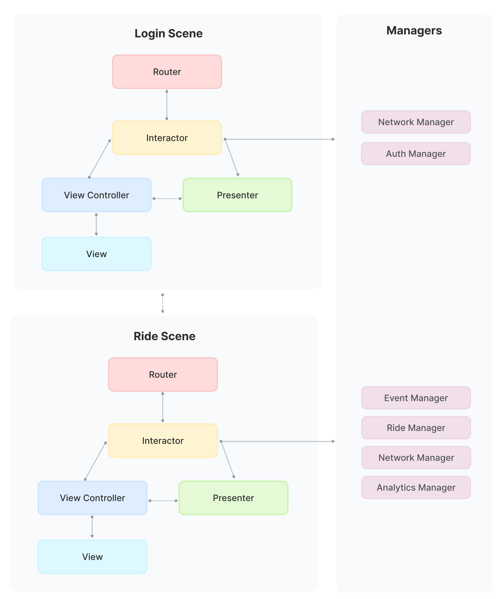

# SNPArchitecture

## Introduction

SNPArchitecture is an iOS app architecture created for iOS apps in [Snapp*‌!*](https://github.com/snapp-cab). This architecture can be used in iOS apps with a large number of Scenes and developers. It is an amalgamation of different iOS app architectures such as [VIPER](https://www.objc.io/issues/13-architecture/viper), [Uber RIBs](https://github.com/uber/RIBs), [MVVM](https://www.objc.io/issues/13-architecture/mvvm) and [Clean Swift](https://clean-swift.com/clean-swift-ios-architecture) based on the principles of [Uncle Bobs’s](https://en.wikipedia.org/wiki/Robert_Cecil_Martin) [Clean Architecture](https://8thlight.com/blog/uncle-bob/2012/08/13/the-clean-architecture.html).

SNPArchitecture provides:

- **An scalable architecture.** This architecture has been proven to scale to tens of engineers working on the same codebase and apps with 50+ Scenes already in production.

- **Testability using protocol-oriented design.** It enables dependency injection, which in turn enables testing each class in isolation since every dependency is automatically mocked with easy to provide stubs using [SwiftyMocky](https://github.com/MakeAWishFoundation/SwiftyMocky).

- **Code generation using Xcode templates.** It comes with Xcode templates for quick code generation. Developers only provide a name for the Scene and almost all boilerplate code is automatically generated.

## Scene

An app is divided into modules based on screen/feature, which we’ll call a `Scene`. A scene is comprised of these classes:
- `View`
- `Interactor`
- `Presenter`
- `Router`
- `Configurator`

View handles view logic, Interactor handles business logic, Presenter handles presentation logic, Router handles routing logic and Configurator will act as the builder of the Scene. We’ll discuss all of them shortly.

Keep in mind that all the interaction between classes in a Scene happens through protocols and none of them are tightly coupled. 



### View

Unlike Apple’s MVC, View in SNPArchitecture is both View and View Controller objects. Since View and View Controller are tightly coupled in UIKit, it doesn’t make much sense to separate them. Because View Controller handles View’s lifecycle, it is nearly impossible to write decoupled View and View Controllers, i.e. if you change one of them, you must change the other.

View handles all the view logic, it knows how to show stuff on the screen and relays user’s interactions to Interactor. In order to better separate View and View Controller responsibilities, everything purely view-related stuff (such as setting static labels or colors) goes in UIView objects and lifecycle-related stuff goes into UIViewController objects.

As you can see in the diagram above, View directly notifies the Interactor of user interactions. Methods would be named like `fooButtonTapped()`.

On the other hand, Presenter calls methods like `show(viewModel:)` on the View. Notice how Presenter passes a `View Model` to the view, which is a simple data structure comprised of primitive types such as `Int` and `String`. This is important because view cannot and must not perform any logic on the received View Model. 

### Interactor

Interactor contains all the business logic of a Scene. It knows how to ask for data, which Scene to show next and everything related to our business.

Interactor doesn’t talk to the View directly, instead, it asks the Presenter to present some stuff on the View with methods named like `present(businessModel:)`. Notice how it passes a `Business Model` to Presenter, and Presenter itself translates this possibly complex data structure to a simple View Model. Remember, View Models are comprised of only primitive types that can be directly consumed by the view. 

On the other hand, it listens to user interactions coming from the View, such as `fooButtonTapped()`.

When a new Scene needs to be shown, it calls a method on the Router. It will be discussed more in the Router section. 

### Presenter

Presenter is the class responsible for translating complex business models to simple View Models. A good example of this would be converting a `Date` object to a human-readable `String`.

We’ve already talked about input and output interfaces of Presenter in View and Interactor sections, but here’s a recap: Presenter listens to method calls from Interactor such as `present(businessModel:)`. It converts the incoming Business Model to a View Model understandable by the View, then calls `show(viewModel:)` on the View to complete the cycle.

### Configurator

Configurator acts as the builder for creating a scene. It has a static `build(dependency1:dependency2:...)` method which initializes a Scene, provides each class its dependencies and returns the View, which is a subclass of UIViewController.

### Router

Router is responsible for routing logic as it knows which Scene to build by calling its Configurator. It creates the next Scene and attaches its View to the View hierarchy. Interactor calls methods such as `navigateToScene(presentingViewController:)` on the Router, Router builds the next Scene using its Configurator by calling `SceneConfigurator.build()` and attaching the resulting View to the View hierarchy. Remember that the Router itself doesn’t decide which Scene to build, but merely knows how to build one. Routing decisions are made by the Interactor. 

### Managers

In an app, there are some classes that don’t belong in Scenes: Model Managers. We will call them `Manager` for simplicity. 

Each Manager is responsible for providing objects of a specific Data Model. Fetching it from the network, optionally caching the result and providing it to anyone who asks for it later. Manager’s methods will take the form of `getModel(parameters:completion:)` and call a completion handler when data is ready or an error has occurred. Most of the completion handlers will have only an `Error?` input, since providing data models will be done by a dispatch system.

### Dispatch System

Since we are developing SNPArchitecture for an eventful and stateful app, traditional delegation and callback patterns won’t accommodate our needs. Consider the state of the `Ride` model. Every change in the ride’s state results in changes all over the appl, so it’s better to use the notification pattern. Since iOS’s own NotificationCenter is a barebone framework, we’ll use [SwiftNotificationCenter](https://cocoapods.org/pods/SwiftNotificationCenter) which provides a simple API to post and observe notifications in a protocol-friendly manner. 

## Sample Scene: About Snapp*‌!*

To better understand SNPArchitecture, let’s develop the "About Snapp*‌!*" scene in the Passenger app together. 

Here is the screenshot of the About Scene:


In this Scene, we want to fetch some text from the network service and navigate to the _Snapp_!’s _Terms and Conditions_ web page if the user taps on the button. 

### 1. View
The `AboutView` is as dummy as possible and knows nothing about other components of the app. Let’s dive in.

All outlets from the storyboard go here:

```swift
class AboutView: UIView {
    @IBOutlet var termsAndConditionsButton: UIButton!
    @IBOutlet var aboutLabel: UILabel!
    // ...
}
```

In the `awakeFromNib()` we set fonts and colors of `AboutView` outlets. We also set an indicator to show and and hide the text label when data is being fetched over network:

```swift
extension AboutView {   
    override func awakeFromNib() {
        super.awakeFromNib()

        // Set fonts
        // Set static texts
    }
}
```

### 2. View Controller

All `ViewController`s in SNPArchitecture inherit from [`SNPViewController`](https://github.com/behdaad/SNPScene). In `SNPViewController` we autmatically call lifecycle methods on Interactor with the power of protocol extensions in Swift. This means we need to have a separate pointer that casts the reference to the Interactor to the correct type and returns it:

```swift
class AboutViewController: SNPViewController {
    var aboutInteractor: AboutInteractorProtocol! {
        get {
            return interactor as? AboutInteractorProtocol
        }
        set {
            interactor = newValue
        }
    }
    private var aboutView: AboutView {
        return view as! AboutView
    }
}
```

Setup initial works in `viewDidLoad()` :

```swift
extension AboutViewController {
    override func viewDidLoad() {
        // Other setup stuff
        aboutView.termsAndConditionsButton.addTarget(self, action: #selector(termsAndConditionsButtonTapped), for: .touchUpInside)
        // Could be directly sent to Interactor, but we prefer this for customizability
    }
}
```

Here `AboutViewController ` tells `AboutInteractor` user has tapped the button:

```swift
extension AboutViewController {      
    @objc func termsAndConditionsButtonTapped() {
        aboutInteractor.termsAndConditionsButtonTapped()
    }
}
```

And whenever the corresponding data is fetched, Presenter calls the `show` method on View Controller:

```swift
extension AboutViewController: AboutViewControllerProtocol {
    func show(aboutText: String) {
        aboutView.aboutLabel.text = aboutText
    }
}
```

### 3. Interactor

keeps a reference to `AboutPresenter` and `AboutRouter`:

```swift
class AboutInteractor: SNPInteractor {
    var presenter: AboutPresenterProtocol!
    var router: AboutRouterProtocol!
}
```

`AboutInteractor` decides to navigate to the terms page when the user taps on the button. It tells `AboutRouter` to do that:

```swift
extension AboutInteractor: AboutInteractorProtocol {
    @objc func termsAndConditionsButtonTapped() {
        router.navigateToTermsAndConditionsWebpage()
    }
}
```

`AboutInteractor` asks for data from `AboutManager` and passes it on to `AboutPresenter`.

```swift
extension AboutInteractor {
    func viewDidLoad() {
        // AboutInteractor has its own AboutManager object as a dependency
        self.aboutManager.fetchAbout(completion: { [weak self] aboutText in
            self?.presenter.present(aboutText: aboutText)
        })
    }    
}
```

`AboutManager` knows how to get requested data using [`SNPNetwork`](https://github.com/snapp-cab/SNPNetwork):

```swift
private class AboutManager {
    private struct URL {
        static let about = ServerManager.shared.baseAPIPrefix + "about"
    }
    func fetchAbout(completion: @escaping (String) -> Void) {
        SNPNetwork.shared.request(url: URL.about, encoding: JSONEncoding.default, responseKey: "data.text") { about, error in
            // Check for errors
            completion(about ?? "")
        }
    }
}
```

### 4. Presenter

Keeps a reference to the `AboutViewController`. As you see the reference is marked __weak__ to avoid reference cycles:

```swift
class AboutPresenter: SNPPresenter {
    weak var viewController: AboutViewControllerProtocol!
}
```

`AboutPresenter`’s job is to format a given data model from the `AboutInteractor` as a viewModel then present it to the `AboutViewController`. As we don’t have any complex data model here, we just simply pass it to the `AboutViewController`.

```swift
extension AboutPresenter: AboutPresenterProtocol {
    func handle(error: SNPError?) {
        viewController.showErrorDialog(errorViewModel: error?.viewModel)
    }
    
    func present(aboutText: String) {
        // Optionally convert data to a view-comprehensible type
        viewController.show(aboutText: aboutText)
    }
}
```

### 5. Router

Typically we need `UIViewController` to navigate so we store a reference to it.

```swift
class AboutRouter: SNPRouter {
    weak var viewControllerProtocol: AboutViewControllerProtocol!
}
```

In the About Scene we just need to create a Web View Controller when the user tapped on the _Terms and Conditions_ button:

```swift
extension AboutRouter: AboutRouterProtocol {
    func navigateToTermsAndConditions() {
        if let url = URL(string: "http://snapp.ir/terms") {
            let webViewContoller = SNPWebViewController(url: url)
            let presentingViewController = viewControllerProtocol.viewController as? AboutViewController
            presentingViewController.present(webViewContoller, animated: true, completion: nil)
        }
    }
}
```

### 6. Configurator

The `AboutConfigurator`’s job is to build the scene by initializing `AboutViewController` from storyboard and hook up all the scene components respectively.

```swift
class AboutConfigurator: SNPConfigurator {
    class func build(aboutManager: AboutManager) -> (AboutViewController, AboutInteractor) {
        let viewController: AboutViewController = UIStoryboard.loadViewController()
        // Dependency injection
        let interactor = AboutInteractor(aboutManager: AboutManager)
        let presenter = AboutPresenter()
        let router = AboutRouter()

        // Since we have a cyclic dependnecy graph, we have to use property dependency injection as opposed to initializer dependency injection
        viewController.interactor = interactor

        interactor.presenter = presenter
        interactor.router = router
        
        presenter.viewController = viewController
        
        router.viewControllerProtocol = viewController
        
        return (viewController, interactor)
    }
}
```

In this article you saw the flow of SNPArchitecture in a simple Scene. The `AboutViewController` passes user interactions to `AboutInteractor` which asks for needed data and passes it to `AboutPresenter` which formats and prepares it to be shown by `AboutViewController` and thus closing the cycle.

## Installation

First you need to add [SNPScene](https://github.com/snapp-cab/SNPScene) pod to your project. 

To install SNPArchitecture Xcode templates, first clone this repository, then `cd` to its directory and run:

```bash
make install_templates
```

To uninstall the SNPArchitecture Xcode templates, run:

```bash
make uninstall_templates
```

You can also create git hooks to automatically install the new version when you commit your changes or merge others’ changes.

1. Create a file named `post-merge` under `.git/hooks` and fill it with:

```bash
#!/bin/sh
make install_templates
```

2. Add execution permissions to `post-merge` using:

```bash
chmod +x post-merge
```

3. Since it’s not a remote possibility that you’ll someday commit and push changes to this repository, you may want to add a `post-commit` hook too. It will be the same as `post-merge`. This can be simply done using

```bash
cp post-merge post-commit
```

Voilà! Every time you pull this repo, templates will be automatically installed in your Xcode templates folder.
